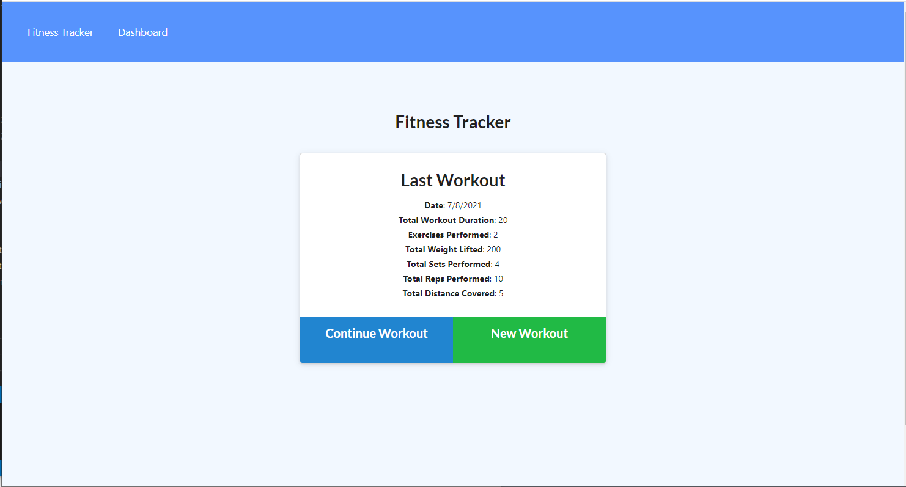
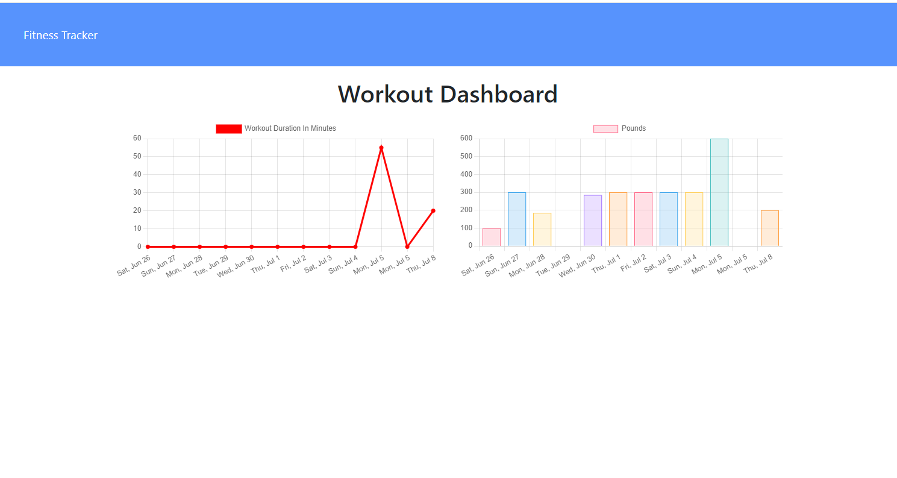

# workoutTracker

## Description

A consumer will reach their fitness goals more quickly when they track their workout progress.  For this assignment, you'll create a workout tracker.  This assignment will require you to create Mongo database with a Mongoose schema and handle routes with Express.

## Installation and Start

npm i, npm start

## Link to deployed site

## Screenshots

## Questions

If you have any questions, please refer to my Github page, [JamieKaczor](https://github.com/JamieKaczor), or contact me through my email, Dignanjk@aol.com